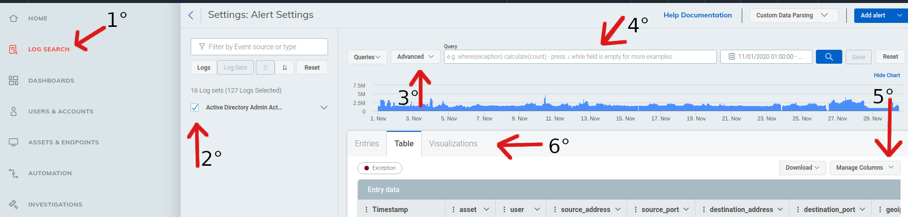

# LEQL CHEAT SHEET Rapid7 SIEM InsightIDR  
[]()  
>
> Here you find several examples of Log Entry Query Language (LEQL) queries used by the rapid7 SIEM to fine tune their searches. :alien:  
> **Attention:** This is an independent and voluntary tutorial and all the information described here can be studied and deepened at
> [Rapid7 InsightIDR](https://docs.rapid7.com/insightidr/log-search "Click here to access the page").


## Instructions:  
[]()  

##### 1° Log Search:  
On InsightIDR home screen click on "Log Search" to access the SIEM queries screen.  

##### 2° Settings Logs:  
This part allows you to select the servers whose logs are being  
collected, this is interesting to fine-tune your searches, for example:  
only AD logs and not firewalls.  

##### 3° Query Type:  
In order to use advanced queries in Log Search you  
must select the query type as advanced.  

##### 4° Query:  
Here you must enter the desired query, note that the query must have  
the appropriate environment information, for example login name of  
the target user if this is what you are looking for.  
**Note**: You must set the time window on the right side to get the desired logs.  


##### 5° Manage Columns:  
At this stage, you should already have the result of your query and by  
clicking on "Manage Columns" you can define the view only the  
columns of your interest.  

##### 6° Visualizations:  
After your query is ready you can use this function to view and create graphs of various types , for example:  
* Pie Chart  
* Bar Chart  
* Horizontal Bar Chart  


## LEQL queries examples:  

#### Find specific action:  
```
where(source_user="grp adm" action="ACCOUNT_DISABLED")
```

#### Find specific action and count number:  
```
where(source_user="grp adm" action="ACCOUNT_DISABLED") calculate(count)
```

#### Find specific device:  
```
where(asset="iphone_of_siem")
```

#### Find specific event ID:  
```
where(4725)
```

#### Find specific Mac address:  
```
where(client_mac="11:22:33:aa:bb:cc")
```

#### Search specific User:  
```
destination_account="alice.winchester"
```

#### Find all logs the specific IP:  
```
where("192.168.1.1")
```

#### Find source logs the specific IP:  
```
where(source_ip="192.168.1.1")
```  
**Or**  
```
where(source_address="192.168.1.1")
```  

#### Find destination logs the specific IP:  
```
where(destination_ip="192.168.1.1")
```  
**Or**  
```
where(destination_address="192.168.1.1")
```  

#### Find specific source port:  
```
where(source_port="22")
```

#### Find specific destination port:  
```
where(destination_port="443")
```

#### Find http method:  
```
where(http_method="get")
where(http_method="post")
```

#### Find the specific url:  
```
where(url="https://google.com/")
```

#### Find the specific host:  
```
where(url_host="google.com")
```

#### Find direction firewall type:  
```
where(direction="OUTBOUND")
where(direction="INTERNAL")
```

#### Find user Alice with regex:  
```
where(/Alice (?P<VARIABLE>\s*)/ )
```

#### Find all e-mail:  
```
where(/@domain.com/)
```